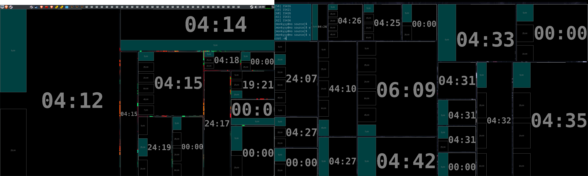

# pomodomo

My pomodomo app, run it without agruments from the commandline to get the spiel about using it.

Code from my layout experiment, code is there; awful won't be mantained code. Buts its a box that shows number, and I use tiling wms so it should be good enough given the other options are shit.

